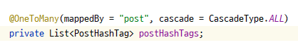

# [1Week] 김아름

## 미션 요구사항 분석 & 체크리스트

### 1. 회원 관련
1. 요구사항 분석
- 스프링 시큐리티 사용 로그인/로그아웃
- 회원은 닉네임 유무에 따라 일반/작가회원으로 나뉨
  - 초기 회원가입시 모든 회원은 일반 회원
  - 프로필 수정에서 닉네임 변경을 통해 작가 등록이 가능
- 작가 회원은 상품, 글 관련 기능 이용이 가능
- 이메일을 통해 아이디 찾기를 할 수 있음
- 이메일, 아이디를 통해 비밀번호 찾기를 할 수 있음

2. 개발 체크리스트
- [x] 회원가입
- [x] 회원정보수정
- [x] 로그인
- [x] 로그아웃
- [x] 아이디찾기
- [x] authLevel 설정
- [ ] 회원가입 축하메일

### 2. 글 관련
1. 요구사항 분석
- 글 작성 시 토스트 에디터를 활용
- 마크다운 원문 및 html 렌더링 결과 모두 저장
- 글 삭제 시 글 전체 리스트로 리다이렉트
- 해시태그 기능
  - 글 리스트에 해시태그 노출
  - 글 상세페이지에 해시태그 노출

2. 개발 체크리스트
- [x] 글 작성
- [x] 글 수정
- [x] 글 리스트
- [x] 글 삭제
- [x] 글 작성 권한 설정
- [x] 글 작성시 해시태그 추가 구현

---

## 1주차 미션 요약

### [접근 방법]

- 권한이 필요한 동작들이 있어 Member > Post의 순으로 개발을 진행  
- 원활한 이용을 위해 오류는 최대한 warningModal로 해결
- 닉네임 유무에 따라 authLevel 설정

<br/>

#### 1. Member 회원 가입, 정보 수정, 아이디 찾기  
- 회원가입 시 닉네임 정보를 입력할 수 있는 input을 설정하였으나 초기 회원가입 시 모든 회원은
일반 회원이라는 요구사항에 맞게 닉네임 정보 입력을 삭제  
- 프로필 페이지를 추가하여 회원의 아이디, 이메일, 닉네임 정보 확인 가능
- 프로필 페이지에서 회원정보 수정 버튼을 통해 회원정보 수정 페이지로 이동
- 회원정보 수정 페이지에서 닉네임을 입력하면 작가 회원으로 권한 변경
  
  - 회원정보 modify 단계에서 nickname이 "" 이거나 null이면 authLevel=3 / nickname이 빈 문자열이 아니면 authLevel=7이 되도록 구현

- 로그인/로그아웃 기능은 Spring Security를 이용해 SecurityConfig에서 구현

<br/>

#### 2. 글 CURD
- 초기에는 회원의 authLevel, 해시태그 관계 없이 글쓰기 가능하도록 구현

  - 글쓰기 버튼에 ```hasAuthority('ADMIN')``` 옵션을 주어 관리자 권한 회원만 버튼을 볼 수 있도록 변경
  - PostHashTag, PostKeyword 추가하여 해시태그 기능 구현

<br/>

> 📌 메인 페이지에서 리스트가 만들어지지 않는 문제
> 
원인 : /post/list.html 에서 필요한 post 객체 정보 리스트를 넘겨주지 않음

해결: QueryDsl 추가하여 최신 100개의 글을 저장하는 getRecentPost() API 생성하여 model로 전달

<br/>

> 📌 해시태그 클릭 하여 redirect 되는 글 리스트에서 태그에 해당하는 글만 나오는 것이 아닌
> 전체 글 리스트가 나오는 문제 발생
>
원인 : getListUrl() 메서드로 설정한 url의 kwType과 Post 검색 메서드의 kwType 불일치

해결: getListUrl()에서 리턴하는 url의 kwType 수정

<br/>

> 📌 해시태그 구현 이후 글 삭제 시 ```spring cannot delete or update a parent row``` 에러 발생  
> 
원인 : 1:N 관계로 연결되어 있는 PostHashTag 테이블에서 참조 중인 외래키로 인해 테이블 삭제 또는 변경 불가능  

해결: 부모 entity인 Post entity에 @OneToMany 컬럼 추가 후 ```mappedBy, casecase``` 옵션 설정   


<br/>

### [특이사항]

#### 토스트 에디터  
- [ ] 글 상세 토스트뷰어 안됨 -> 마크다운 해석 불가
- [ ] 글 수정 시 초기 내용에 추가적인 마크다운 내용을 붙이면 수정 페이지에 가도 에디터가 안보임
- [ ] 토스트 에디터 툴바 아이콘 보이지 않음  

> 토스트에디터를 활용하기 위해 공식문서 및 수업때 활용한 부분을 참고하였는데,   
툴바 아이콘이 제대로 불러와지지 않거나 뷰어 적용이 안되는 등의 문제가 발생  
글쓰기 과정에서 마크다운 내용을 저장하는 부분은 예제 코드와 동일  
db에 저장된 마크다운 및 html 내용을 불러오는 단계에서 발생한 문제로 예상

