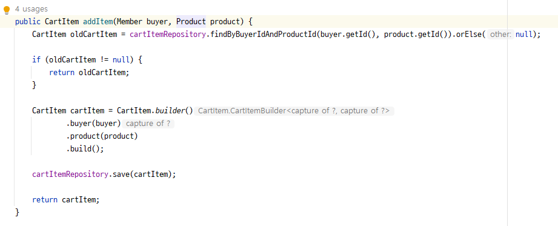
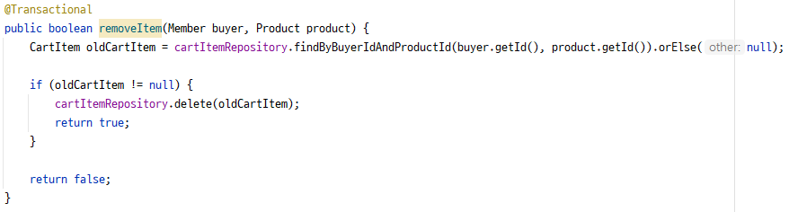

# [2Week] 김아름

## 미션 요구사항 분석 & 체크리스트

### 1. 요구사항 분석
#### - 장바구니
- 상품 = 도서
- 장바구니에 도서를 추가/삭제 가능
- 장바구니를 통해 주문을 만들 수 있다

#### - 주문/결제
- 주문을 하면 초기상태는 준비상태  
  
  - 결제 또는 주문 취소 가능
- 결제 시 캐시 사용 또는 페이먼츠 이용 가능
- 결제 완료 시 MyBook 페이지에서 구매한 도서 열람 가능

### 2. 개발 체크리스트
#### 1. 장바구니
- [x] 장바구니에 상품 추가
- [x] 장바구니에서 상품 삭제
- [x] 장바구니 상품 확인

#### 2. 예치금
- [ ] 예치금 관련 기록 테이블 CashLog

#### 3. 주문 및 결제
- [ ] 예치금을 통한 결제 가능
- [ ] 토스 페이먼츠 연동
- [ ] 토스 페이먼츠 이용한 카드결제
- [ ] 결제 후 MyBook에서 구매한 도서 확인 가능

---

## 2주차 미션 요약

### [접근 방법]
- 장바구니 -> 예치금 -> 주문 -> 결제 -> MyBook

#### 1. 장바구니

- 구매자, 상품 정보를 담은 CartItem 테이블
- addItem()  
  상품을 장바구니에 추가해주는 메서드
  

  상품 상세페이지에서 **장바구니 담기** 버튼을 통해 product.id POST 전송  
 

- removeItem()  
  장바구니에서 상품을 삭제해주는 메서드
     
   

- hasItem()  
  장바구니에 특정 상품이 존재하는지 확인하는 메서드

### [특이사항]

